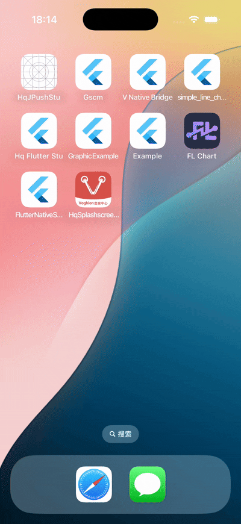

# 启动页适配

flutter create --org com.hq.app  --platforms=android,ios  .

# 效果
Android 启动页效果


iOS 启动页效果




# android 启动页配置

##  准备资源
  * 启动页背景图片：v_app_launch_bg
  * 启动页logo图片：v_app_launch_logo
## 将资源添加到项目中
  * Android：将启动页背景图片和启动页logo图片添加到`res/mipmap-xxx`目录下，根据资源目录分类添加自行添加
  * 在`res/drawable`和`res/drawable-v21`目录下添加/修改`launch_background.xml`文件
`launch_background.xml` 配置如下
```xml
<?xml version="1.0" encoding="utf-8"?>
<!-- Modify this file to customize your launch splash screen -->
<layer-list xmlns:android="http://schemas.android.com/apk/res/android">
    <item android:drawable="@mipmap/v_app_launch_bg"/>
    <item android:gravity="center" android:drawable="@mipmap/v_app_launch_logo" />
</layer-list>
```
## 修改主题
  * Android：在`res/values/styles.xml`和`res/values-v21/styles.xml`文件中，如下：
```xml
<?xml version="1.0" encoding="utf-8"?>
<resources>
    <!-- Theme applied to the Android Window while the process is starting when the OS's Dark Mode setting is off -->
    <style name="LaunchTheme" parent="@android:style/Theme.Light.NoTitleBar">
        <!-- Show a splash screen on the activity. Automatically removed when
             the Flutter engine draws its first frame -->
        <item name="android:windowBackground">@drawable/launch_background</item>
    </style>
    <!-- Theme applied to the Android Window as soon as the process has started.
         This theme determines the color of the Android Window while your
         Flutter UI initializes, as well as behind your Flutter UI while its
         running.

         This Theme is only used starting with V2 of Flutter's Android embedding. -->
    <style name="NormalTheme" parent="@android:style/Theme.Light.NoTitleBar">
        <item name="android:windowBackground">?android:colorBackground</item>
    </style>
</resources>
```

## 适配安卓12主题，这里是将12以上的相关启动设置透明,然后用一个 `SplashActivity`来做启动页
页配置到`res/values-v31/styles.xml`文件中，如下：
```xml
<?xml version="1.0" encoding="utf-8"?>
<resources>
    <style name="Theme.SplashTheme" parent="Theme.Material3.DayNight.NoActionBar">
        <item name="colorPrimary">@android:color/transparent</item>
        <item name="android:windowBackground">@android:color/transparent</item>
        <item name="android:windowIsTranslucent">true</item>
        <item name="android:windowFullscreen">true</item>
        <item name="android:windowContentOverlay">@android:color/transparent</item>
        <item name="android:windowNoTitle">true</item>
        <item name="android:windowDrawsSystemBarBackgrounds">false</item>
        <item name="android:statusBarColor">@android:color/transparent</item>

        <!-- 禁用系统启动动画 -->
        <item name="android:windowAnimationStyle">@null</item>
    </style>
</resources>

```
## 代码实现
* app目录下的`build.gradle.kts`添加依赖
```sh
    implementation("androidx.activity:activity:1.10.1")
```
* 创建 `SplashActivity.kt` 类
```kotlin
import android.annotation.SuppressLint
import android.content.Intent
import android.os.Build
import android.os.Bundle
import android.os.Handler
import android.os.Looper
import android.view.View
import android.view.WindowInsets
import android.view.WindowInsetsController
import android.view.WindowManager
import androidx.activity.enableEdgeToEdge
import androidx.appcompat.app.AppCompatActivity
import kotlinx.coroutines.CoroutineScope
import kotlinx.coroutines.Dispatchers
import kotlinx.coroutines.launch
import kotlinx.coroutines.withContext

@SuppressLint("CustomSplashScreen")
class SplashActivity : AppCompatActivity() {
    private var isBackDisabled = true

    override fun onCreate(savedInstanceState: Bundle?) {
        super.onCreate(savedInstanceState)
        setFullScreenWindowLayout()
        // 设置启动页布局
        setContentView(R.layout.activity_splash)

        // 初始化逻辑
        initializeApp()
    }

    private fun setFullScreenWindowLayout() {
        enableEdgeToEdge()
        // 刘海屏适配
        if (Build.VERSION.SDK_INT >= Build.VERSION_CODES.P) {
            window.attributes.layoutInDisplayCutoutMode =
                WindowManager.LayoutParams.LAYOUT_IN_DISPLAY_CUTOUT_MODE_SHORT_EDGES
        }

    }

    private fun initImmersiveMode() {
        if (Build.VERSION.SDK_INT >= Build.VERSION_CODES.R) {
            window.insetsController?.apply {
                hide(WindowInsets.Type.statusBars())
                systemBarsBehavior = WindowInsetsController.BEHAVIOR_SHOW_TRANSIENT_BARS_BY_SWIPE
            }
            window.setDecorFitsSystemWindows(false)
        } else {
            val decorView = window.decorView
            decorView.systemUiVisibility = (
                    View.SYSTEM_UI_FLAG_FULLSCREEN
                            or View.SYSTEM_UI_FLAG_IMMERSIVE_STICKY
                            or View.SYSTEM_UI_FLAG_LAYOUT_STABLE
                            or View.SYSTEM_UI_FLAG_LAYOUT_FULLSCREEN
                    )
        }
    }

    private fun initializeApp() {
        // 模拟初始化任务
        val initializationTasks = listOf(
            { initSdk() },
            { loadConfig() },
            { prepareData() }
        )

        // 并行执行初始化
        CoroutineScope(Dispatchers.IO).launch {
            initializationTasks.forEach { it.invoke() }

            // 所有任务完成后跳转
            withContext(Dispatchers.Main) {
                navigateToMain()

            }
        }

        // 或者：简单延迟跳转（不推荐）
        // navigateToMain()
    }

    private fun initSdk() {
        // 初始化第三方 SDK
    }

    private fun loadConfig() {
        // 加载配置
    }

    private fun prepareData() {
        // 准备初始数据
    }

    private fun navigateToMain() {
        Handler(Looper.getMainLooper()).postDelayed({
            val intent = Intent(this, MainActivity::class.java)

            // 传递启动参数（如果需要）
            intent.putExtras(intent.extras ?: Bundle())

            startActivity(intent)
            overridePendingTransition(android.R.anim.fade_in, android.R.anim.fade_out)
            finish()

        }, 200)

    }


    override fun onBackPressed() {
        // 禁用返回键：直接return，不执行父类逻辑
        if (isBackDisabled) {
            return
        }
        // 如需保留默认行为（如部分场景启用），调用父类方法
        super.onBackPressed()
    }


```

`activity_splash.xml` 配置如下
```xml
<?xml version="1.0" encoding="utf-8"?>
<androidx.constraintlayout.widget.ConstraintLayout xmlns:android="http://schemas.android.com/apk/res/android"
    xmlns:app="http://schemas.android.com/apk/res-auto"
    xmlns:tools="http://schemas.android.com/tools"
    android:id="@+id/main"
    android:layout_width="match_parent"
    android:layout_height="match_parent"
    android:background="@drawable/launch_background"
    tools:context=".SplashActivity">

</androidx.constraintlayout.widget.ConstraintLayout>
```

## 修改`AndroidManifest.xml` 中 `SplashActivity` 的 `android:theme` 为 `@style/Theme.SplashTheme`,并设置为启动页

注意将 `MainActivity` 的 `<intent-filter>`注释掉，配置在 `SplashActivity` 中

整体配置如下：
```xml
<?xml version="1.0" encoding="utf-8"?>
<manifest xmlns:android="http://schemas.android.com/apk/res/android">
    <!--
         Required to query activities that can process text, see:
         https://developer.android.com/training/package-visibility and
         https://developer.android.com/reference/android/content/Intent#ACTION_PROCESS_TEXT.

         In particular, this is used by the Flutter engine in io.flutter.plugin.text.ProcessTextPlugin.
    -->
    <queries>
        <intent>
            <action android:name="android.intent.action.PROCESS_TEXT" />

            <data android:mimeType="text/plain" />
        </intent>
    </queries>

    <application
        android:name="${applicationName}"
        android:icon="@mipmap/ic_launcher"
        android:label="hq_splashscreen_adapt">
        <activity
            android:name=".SplashActivity"
            android:theme="@style/Theme.SplashTheme"
            android:exported="true">
            <intent-filter>
                <action android:name="android.intent.action.MAIN" />

                <category android:name="android.intent.category.LAUNCHER" />
            </intent-filter>
        </activity>
        <activity
            android:name=".MainActivity"
            android:configChanges="orientation|keyboardHidden|keyboard|screenSize|smallestScreenSize|locale|layoutDirection|fontScale|screenLayout|density|uiMode"
            android:hardwareAccelerated="true"
            android:launchMode="singleTop"
            android:exported="true"
            android:taskAffinity=""
            android:theme="@style/LaunchTheme"
            android:windowSoftInputMode="adjustResize">

            <!--
                 Specifies an Android theme to apply to this Activity as soon as
                 the Android process has started. This theme is visible to the user
                 while the Flutter UI initializes. After that, this theme continues
                 to determine the Window background behind the Flutter UI.
            -->
            <meta-data
                android:name="io.flutter.embedding.android.NormalTheme"
                android:resource="@style/NormalTheme" />

<!--            <intent-filter>-->
<!--                <action android:name="android.intent.action.MAIN" />-->

<!--                <category android:name="android.intent.category.LAUNCHER" />-->
<!--            </intent-filter>-->
        </activity>
        <!--
 Don't delete the meta-data below.
             This is used by the Flutter tool to generate GeneratedPluginRegistrant.java
        -->
        <meta-data
            android:name="flutterEmbedding"
            android:value="2" />
    </application>

</manifest>

```

# iOS 启动页配置

##  准备资源
  * 启动页背景图片：v_app_launch_bg
  * 启动页logo图片：v_app_launch_logo

## 将资源添加到项目中
  * 将 `v_app_launch_bg` 添加到 `Assets.xcassets` 中

  * 将 `v_app_launch_logo` 添加到 `Assets.xcassets` 中

  * 在 `LaunchScreen.storyboard` 中添加两个 `Image View`,一个用于背景，一个用于logo，分别命名为 `Background Image View` 和 `Logo Image View`
    
  * 将 `v_app_launch_bg` 绑定到 `LaunchScreen.storyboard` 中的 `Background Image View`
  * 将 `v_app_launch_logo` 绑定到 `LaunchScreen.storyboard` 中的 `Logo Image View`

  * 设置 `Background Image View` 的 `Content Mode` 为 `ScaleAspectFill`
  * 设置 `Logo Image View` 的 `Content Mode` 为 `ScaleAspectFit`

  * 分别为 `Background Image View` 和 `Logo Image View` 添加 `Constraints` 约束，具体见Demo项目
 


# 注意：

注意相关的资源名称的修改和自己的项目中资源名称修成一致的，包括配置中的资源名称


